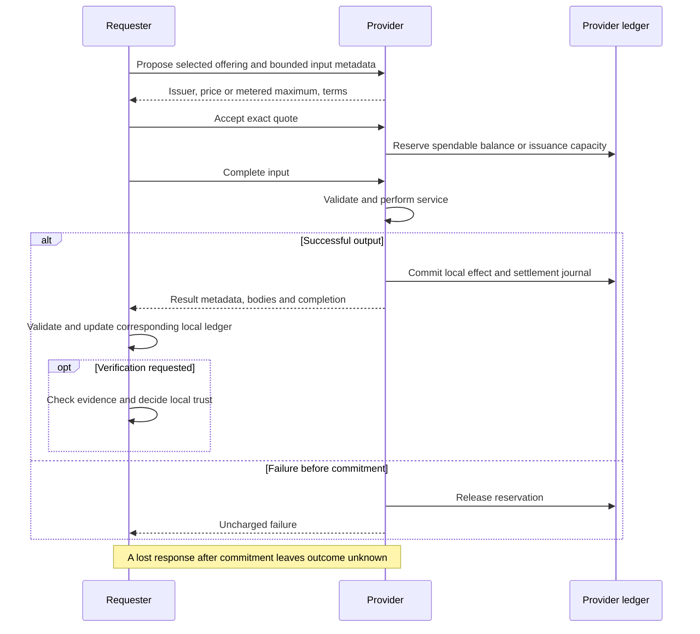

# Services diagrams

[Specification](../README.md) · [Architecture and dependencies](../../../Architecture.md)

```mermaid
sequenceDiagram
    participant Requester
    participant Provider
    participant Ledger as Provider ledger
    Requester->>Provider: Propose selected offering and bounded input metadata
    Provider-->>Requester: Issuer, price or metered maximum, terms
    Requester->>Provider: Accept exact quote
    Provider->>Ledger: Reserve spendable balance or issuance capacity
    Requester->>Provider: Complete input
    Provider->>Provider: Validate and perform service
    alt Successful output
        Provider->>Ledger: Commit local effect and settlement journal
        Provider-->>Requester: Result metadata, bodies and completion
        Requester->>Requester: Validate and update corresponding local ledger
        opt Verification requested
            Requester->>Requester: Check evidence and decide local trust
        end
    else Failure before commitment
        Provider->>Ledger: Release reservation
        Provider-->>Requester: Uncharged failure
    end
    Note over Requester,Provider: A lost response after commitment leaves outcome unknown
```
